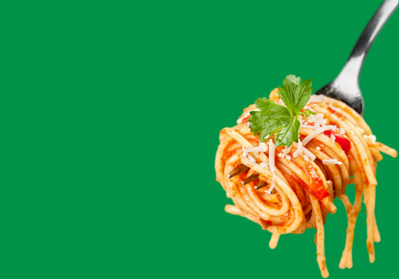
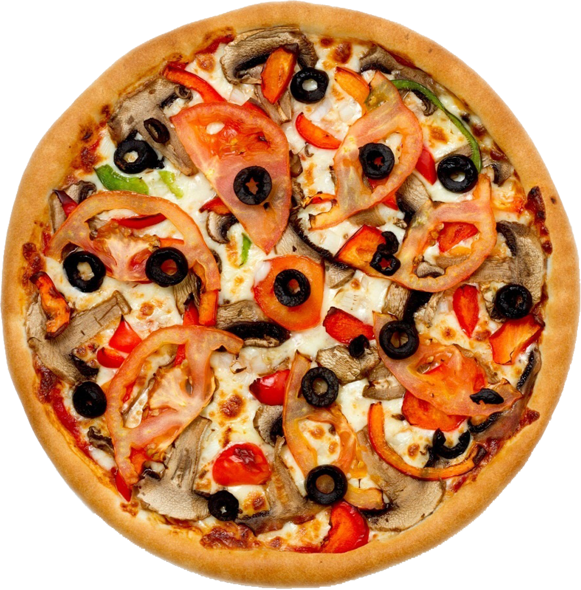

# 🍕 Restaurant Food Delivery App — UI-005: Add Offers and Category Display

This update introduces a dynamic category menu and detailed category product listings. Users can now browse through food categories like **Pastas**, **Burgers**, and **Pizzas**, each offering a unique visual experience and an easy navigation system.

---

## ✨ Features Introduced

### ✅ Category Menu Page (`/menu`)
- A responsive layout displaying all food categories.
- Each category section includes:
    - A visually rich background image.
    - Title and description.
    - An "Explore" button (visible only on 2XL screens).
- Clickable areas using `Next.js` `Link` to navigate to individual category pages (`/menu/[slug]`).

> **File:** `src/app/menu/page.jsx`  
> **Component:** `MenuPage`

---

### ✅ Category Product Page (`/menu/[category]`)
- Displays a list of products (e.g., pizzas) related to the selected category.
- Each product card includes:
    - Optimized image using `next/image`.
    - Title, description, and price.
    - "Add to Cart" button visible on hover.
- Responsive grid layout (mobile, tablet, desktop).
- Client-side navigation to individual product pages via `/product/[id]`.

> **File:** `src/app/menu/[category]/page.jsx`  
> **Component:** `CategoryPage`

---

## 🧾 Code Structure Summary

### 📁 `MenuPage.jsx`
- Utilizes a `menu` array to dynamically render category sections.
- Navigation built with dynamic routing: `/menu/[slug]`.

### 📁 `CategoryPage.jsx`
- Uses a hardcoded `pizzas` array to render category-specific product cards.
- Each card includes image rendering, hover interactions, and dynamic links to product pages.

---

## 🚀 Technologies Used

- **Next.js 13+ App Router**
- **React 18**
- **Tailwind CSS**
- **Next/Image** for image optimization
- **Client-Side Navigation** via `next/link`

---

## 🖼 Screenshots

Menu Page Preview

Category Page Preview

---

## 📌 To Do

- Replace hardcoded arrays with dynamic data from an API (e.g., Strapi, Firebase).
- Improve accessibility (add `alt` text to images).
- Implement cart functionality.
- Add category filtering and sorting options.

---

## 🧠 Notes

- UI elements have been styled with Tailwind CSS for responsiveness and rapid development.
- `Explore` and `Add to Cart` buttons use conditional rendering to enhance user interaction.

---

## 🧑‍💻 Author

Developed by "Mohammad Arifur Rahman"  
For questions or contributions, feel free to open issues or pull requests.

---

## 📄 License

This project is licensed under the [MIT License](LICENSE).
